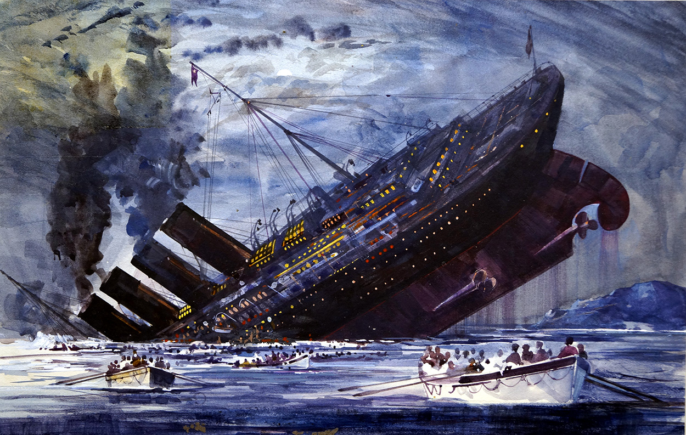

# Kaggle Data Science - Titanic: Machine Learning from Disaster
##  Author: Jaekyung Lee

### Methodology
The sinking of the RMS Titanic is one of the most infamous shipwrecks in history.  On April 15, 1912, during her maiden voyage, the Titanic sank after colliding with an iceberg, killing 1502 out of 2224 passengers and crew. This sensational tragedy shocked the international community and led to better safety regulations for ships. 

One of the reasons that the shipwreck led to such loss of life was that there were not enough lifeboats for the passengers and crew. Although there was some element of luck involved in surviving the sinking, some groups of people were more likely to survive than others, such as women, children, and the upper-class. 

In this challenge, we ask you to complete the analysis of what sorts of people were likely to survive. In particular, we ask you to apply the tools of machine learning to predict which passengers survived the tragedy.  

### Data Overview
The data has been split into two groups:
- `train.csv`: training set
- `test.csv`: test set
- The training set should be used to build your machine learning models. For the training set, we provide the outcome (also known as the “ground truth”) for each passenger. Your model will be based on “features” like passengers’ gender and class. You can also use feature engineering to create new features.
- The test set should be used to see how well your model performs on unseen data. For the test set, we do not provide the ground truth for each passenger. It is your job to predict these outcomes. For each passenger in the test set, use the model you trained to predict whether or not they survived the sinking of the Titanic.
- `gender_submission.csv`: a set of predictions that assume all and only female passengers survive, as an example of what a submission file should look like.

#### Variable Notes
**pclass**: A proxy for socio-economic status (SES)
- 1st = Upper
- 2nd = Middle
- 3rd = Lower

**age**: Age is fractional if less than 1. If the age is estimated, is it in the form of xx.5  
**sibsp**: The dataset defines family relations in this way.. . 
**Sibling** = brother, sister, stepbrother, stepsister  
**Spouse** = husband, wife (mistresses and fiancés were ignored)  

**parch**: The dataset defines family relations in this way...  
**Parent** = mother, father  
**Child** = daughter, son, stepdaughter, stepson  
Some children travelled only with a nanny, therefore parch=0 for them.  

### Summary of Findings
- Male died much more than females
- Passengers with family are more likely to survive
- A majority of passengers were embarked from Southampton
- Older passengers are not likely to survive
- However, 25-33 age group died the most (We can predict those people were willing to sacrifice their lives)
- Passengers paid more fare are highly likely to survive since their cabins are on the high levels and close to the deck
- Single passengers have the highest death rate.

### Feature engineering
**Feature engineering** is the process of using domain knowledge of the data to create features that make machine learning algorithms work. Feature engineering is fundamental to the application of machine learning, and is both difficult and expensive.  

- In this process, I will try to build relevant features from raw features in the dataset.  
- Our main goal is to maximize the predictive power of the Machine Learning algorithm or structure.  
- I filled out missing values in `Age`, `Embarked`, `Cabin` columns with feature engineering methods and data-wrangled dataset in feature-vector

### Modeling
- Perform K-fold Cross Validation
- Utilized kNN, Decision Tree, Random Forest, Naive Bayes, SVM models to calculate score

### Testing Result
- With SVM giving the highest score, I submitted `submission.csv` file and checked my score (ranked in 7100)
- Since it's my first submission, I will use XGBoost to increase my score and re-submit again. 
